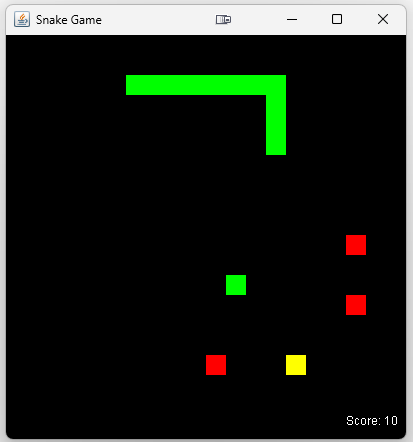

# Snake Game in Java

This project is a Java implementation of the classic Snake game. It features a GUI where the player controls a snake, aiming to eat food while avoiding collisions with the walls or itself. The game includes different types of food that affect the gameplay in various ways.

## Features

- Customizable board size through user input at the start of the game.
- Different types of food with unique colors indicating their effects:
  - **Green Food**: Regular food that increases the snake's length by 1.
  - **Red Food**: Bad food (types 7 and 8) that should be avoided (Halves snake size).
  - **Yellow Food**: Special food (type 9) that  that increases the snake's length by 5.
- The game keeps track of the score based on the snake's length.
- The game speed adjusts as the snake eats more food.
- Collision detection with the walls, itself, or food items.
- Use of Java Swing for the GUI.

## How to Run

To run the game, you need to have Java installed on your computer. Follow these steps:

1. Clone the repository to your local machine.
2. Navigate to the directory containing `SnakeGame.java`.
3. Compile the Java file using the command: `javac SnakeGame.java`.
4. Run the compiled class with: `java SnakeGame`.

## Controls

- **Arrow Keys / WASD Key**: Use the arrow or wasd keys to change the direction of the snake.
- **P Key**: Press the 'P' key to pause and resume the game.
- **Esc Key**: Press the 'Esc' key to close out of the game.

## Customization

You can customize the game by modifying the source code. For example, you can change the maximum number of food items on the board, the types of food, and their effects on the snake.

## Contributing

Contributions to the project are welcome. You can contribute by improving the game's functionality, fixing bugs, or adding new features. Please feel free to fork the repository and submit a pull request.

## License

This project is open-source and available under the MIT License.
